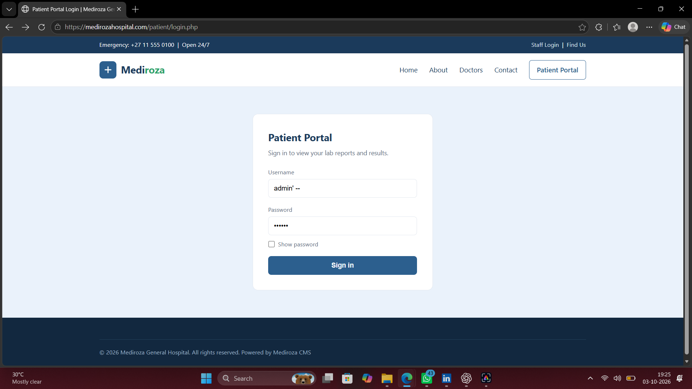
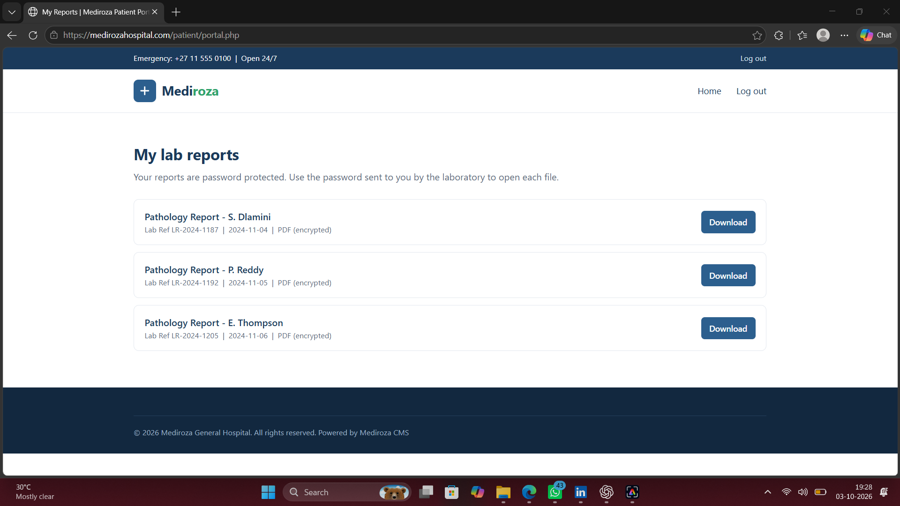
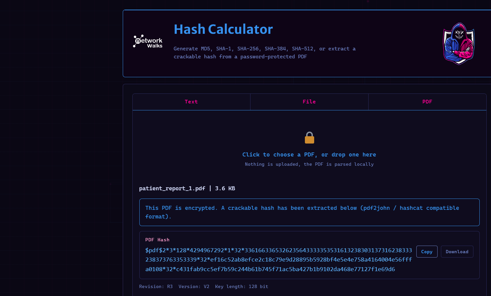
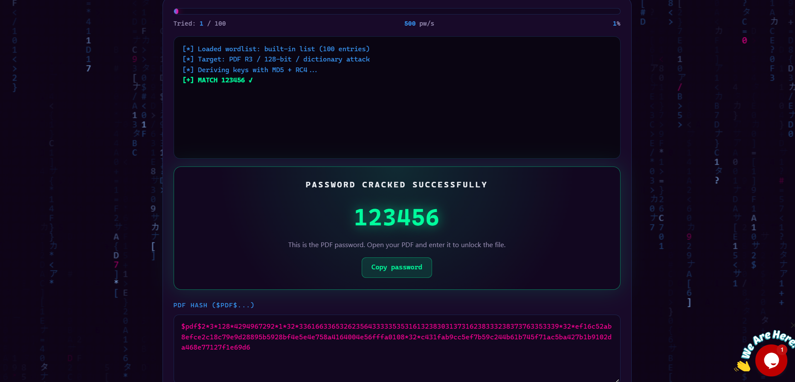
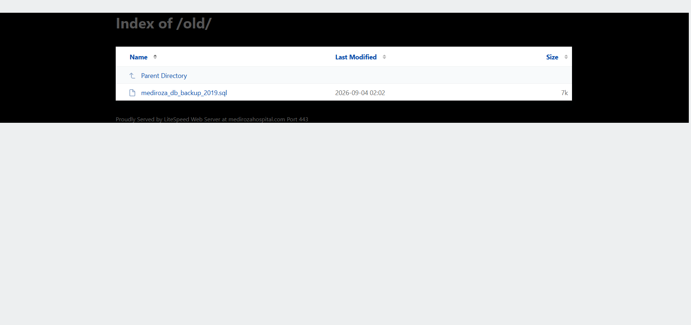
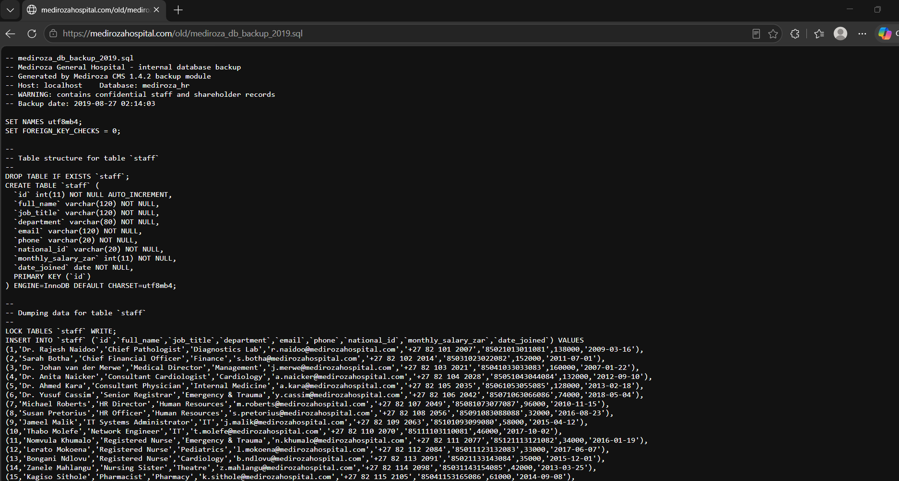
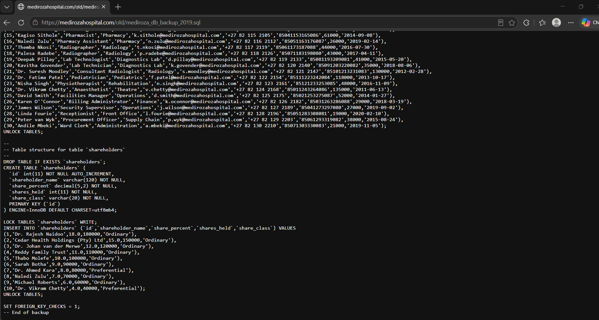

# NETWORKWALKS B083 - WK4 - Mediroza Penetration Testing

## Overview

This repository contains my Week 4 cybersecurity internship project completed as part of the NetworkWalks cybersecurity lab.

The project focuses on performing a controlled penetration testing assessment of the Mediroza General Hospital web application.

The assessment covers reconnaissance, authentication testing, SQL Injection, authentication bypass, PDF security testing, directory listing, backup exposure, and sensitive information disclosure.

> This project was performed only against the authorized educational target provided for the NetworkWalks lab.

---

## Target

**Target:** `https://medirozahospital.com`

**Batch:** B083

**Week:** 4

**Project:** Mediroza General Hospital - Penetration Testing

---

## Objectives

The main objectives of this project were:

* Perform reconnaissance on the target website
* Identify hidden directories and application paths
* Discover the patient login portal
* Test the authentication mechanism
* Identify SQL Injection vulnerabilities
* Test authentication bypass
* Access the available patient reports
* Analyze encrypted PDF files
* Test PDF password security
* Perform deeper reconnaissance
* Identify exposed directories and backup files
* Analyze the exposed database backup
* Document security vulnerabilities
* Provide remediation recommendations

---

## Methodology

The penetration testing process was performed in the following stages:

```text
Reconnaissance
      ↓
Patient Portal Discovery
      ↓
Authentication Testing
      ↓
SQL Injection Testing
      ↓
Authentication Bypass
      ↓
Patient Report Access
      ↓
PDF Security Testing
      ↓
Password Cracking
      ↓
Deep Reconnaissance
      ↓
Backup File Discovery
      ↓
Database Analysis
      ↓
Security Findings & Recommendations
```

---

# 1. Reconnaissance

The first stage involved checking the `robots.txt` file to identify directories that were not intended to be indexed by search engines.

The following directories were identified:

```text
/patient/
/staff/
/old/
```

The `/patient/` directory was then used to locate the patient portal.

---

# 2. Patient Portal Discovery

The patient login page was identified at:

```text
https://medirozahospital.com/patient/login.php
```

The authentication mechanism was tested for security weaknesses.

### Evidence



---

# 3. Patient Reports

After accessing the patient portal, three patient reports were available:

```text
patient_report_1.pdf
patient_report_2.pdf
patient_report_3.pdf
```

These files were used for the next stage of the security assessment.

### Evidence



---

# 4. PDF Hash Extraction

The downloaded PDF files were password protected.

A PDF hash was extracted from the protected document for password security testing.

### Evidence



---

# 5. PDF Password Cracking

The extracted PDF hash was tested against a password wordlist.

The password for one of the reports was successfully recovered:

```text
123456
```

This demonstrated the weakness of using common passwords to protect sensitive documents.

### Evidence



---

# 6. Deep Reconnaissance

Further analysis of the available information revealed an `/old/` directory on the target.

The directory was accessible through the web server.

Directory listing was enabled, allowing files within the directory to be viewed.

### Evidence



---

# 7. Database Backup Exposure

The `/old/` directory exposed a database backup file:

```text
mediroza_db_backup_2019.sql
```

The backup contained database information that could be analyzed offline.

The exposed information included staff and shareholder records.

### Staff Data



### Shareholder Data



---

# Vulnerabilities Identified

| No. | Vulnerability                           | Risk     |
| --- | --------------------------------------- | -------- |
| 1   | Username Enumeration                    | Medium   |
| 2   | SQL Injection Authentication Bypass     | Critical |
| 3   | Patient Report Exposure                 | High     |
| 4   | Weak PDF Passwords                      | High     |
| 5   | Sensitive PDF Metadata Exposure         | Medium   |
| 6   | Directory Listing and Backup Exposure   | Critical |
| 7   | Sensitive Database Information Exposure | Critical |

---

# Security Findings

## 1. Username Enumeration

The login application provides different responses for valid and invalid usernames.

This can allow an attacker to identify valid user accounts.

### Recommendation

Use a generic authentication error message for both invalid usernames and incorrect passwords.

---

## 2. SQL Injection

The login functionality was vulnerable to SQL Injection.

SQL Injection can allow attackers to manipulate database queries and potentially bypass authentication.

### Recommendation

* Use prepared statements
* Use parameterized queries
* Validate user input
* Never directly concatenate user input into SQL queries
* Apply least-privilege database permissions

---

## 3. Patient Report Exposure

Patient reports became accessible after bypassing the authentication mechanism.

Sensitive documents should only be accessible to authorized users.

### Recommendation

Store sensitive documents outside the public web root and implement proper authorization checks.

---

## 4. Weak PDF Passwords

A weak password was successfully recovered from an encrypted PDF.

### Recommendation

Use strong and unique passwords for sensitive documents and avoid common passwords.

---

## 5. Sensitive PDF Metadata

PDF metadata can contain information about document authors and internal activities.

### Recommendation

Remove sensitive metadata before distributing documents externally.

---

## 6. Directory Listing

Directory listing was enabled on the `/old/` directory.

This exposed files that should not have been publicly accessible.

### Recommendation

Disable directory listing and remove unnecessary files from public directories.

---

## 7. Database Backup Exposure

A database backup was publicly accessible through the `/old/` directory.

The backup contained sensitive staff and shareholder information.

### Recommendation

Database backups should:

* Never be stored inside public web directories
* Be stored in secure locations
* Have strict access controls
* Be encrypted where appropriate
* Be regularly reviewed and securely removed when no longer required

---

# Tools Used

The assessment involved the following tools and techniques:

* Web Browser
* Linux Terminal
* `curl`
* PDF hash extraction
* Password-cracking tools
* `qpdf`
* `exiftool`
* SQL/database analysis
* Web reconnaissance
* Manual penetration testing

---
# Conclusion

The Week 4 Mediroza Hospital penetration testing project demonstrated how multiple security weaknesses can be identified through systematic reconnaissance and security testing.

The assessment covered authentication security, SQL Injection, document protection, password security, directory listing, backup exposure, and sensitive information disclosure.

The project also demonstrated the importance of secure coding practices, proper access control, strong password policies, secure backup management, and regular security assessments.

---

## Disclaimer

This project was completed as part of an authorized educational cybersecurity lab.

The techniques documented in this repository must only be used against systems for which explicit permission has been provided.


Unauthorized security testing against real systems is prohibited.f
